## 产品概述

本项目是一个 Android 绘本管理应用（毛毛虫 App），使用 Jetpack Compose 构建 UI，Room 数据库持久化数据，Coil 加载图片。用户需要解决 GitHub Actions CI/CD 工作流中的编译问题，实现自动构建、测试和部署。

## 核心需求

1. **修复编译错误**：解决 3 个 Kotlin 编译问题，使 CI 能够成功构建 APK
2. **优化 CI 工作流**：修复 SDK 工具路径、环境变量等问题
3. **完善 Release 工作流**：添加正式签名配置，支持生产环境部署
4. **验证构建**：确保 debug 和 release 构建均能通过

## 当前编译问题

- **ImageLoader.kt**：`object ImageLoader` 与 Coil 的 `ImageLoader` 类命名冲突
- **BookRepositoryImpl.kt**：`BookMappers` 中的扩展函数是成员函数，无法通过静态导入直接使用
- **ImageUtils.kt**：cursor 查询结果的空安全类型不匹配

## 技术栈

- **平台**：Android (minSdk 26, compileSdk 35, targetSdk 35)
- **语言**：Kotlin 1.9.24, Java 17
- **构建工具**：Gradle 8.x, AGP 8.5.2
- **UI 框架**：Jetpack Compose (BOM 2024.06.00)
- **依赖注入**：手动注入（Repository 模式）
- **数据库**：Room 2.6.1
- **图片加载**：Coil 2.6.0
- **CI/CD**：GitHub Actions (ubuntu-latest)

## 实现方案

### 编译错误修复策略

1. **ImageLoader 命名冲突**：将 `object ImageLoader` 重命名为 `AppImageLoader`，消除与 Coil `ImageLoader` 的命名冲突
2. **BookMappers 扩展函数**：将 `object BookMappers` 内部的成员扩展函数改为文件级顶层扩展函数，使其可以通过静态导入使用
3. **ImageUtils 空安全**：修复 `getFileSize` 中 cursor 查询结果的类型推断问题，确保返回类型为 `Long`

### CI 工作流优化

1. **移除弃用的 `android-actions/setup-android@v3`**：ubuntu-latest runner 已预装 Android SDK，直接使用 `$ANDROID_HOME`
2. **统一 SDK 路径变量**：使用 `$ANDROID_HOME` 替代已弃用的 `$ANDROID_SDK_ROOT`
3. **优化 Gradle 缓存**：保留 `gradle/actions/setup-gradle@v4` 的缓存机制

### Release 工作流增强

1. **添加签名配置**：通过 GitHub Secrets 注入 keystore，实现正式签名 APK 构建
2. **支持 AAB 发布**：保持 AAB 构建用于 Google Play 上架
3. **分离 Debug/Release 产物**：清晰区分测试包和正式包

## 架构设计

```mermaid
flowchart TD
    subgraph "CI Pipeline"
        A[Push/PR to main] --> B[Setup JDK 17]
        B --> C[Setup Android SDK]
        C --> D[Gradle Cache]
        D --> E[Lint Check]
        E --> F[Unit Tests]
        F --> G[Build Debug APK]
        G --> H[Upload Artifact]
        H --> I[Auto Release on main]
    end
    
    subgraph "Release Pipeline"
        J[Tag push v*] --> K[Setup Environment]
        K --> L[Decode Keystore]
        L --> M[Build Signed APK/AAB]
        M --> N[Upload Artifacts]
        N --> O[Create GitHub Release]
    end
```



## 目录结构

```
.github/
└── workflows/
    ├── ci.yml           # [MODIFY] 优化 CI 配置，修复 SDK 路径
    └── release.yml      # [MODIFY] 添加签名配置，支持正式发布

app/
└── src/
    └── main/
        └── java/
            └── com/maomaochongapp/
                ├── core/
                │   └── image/
                │       └── ImageLoader.kt              # [MODIFY] 重命名 object 消除冲突
                └── picturebook/
                    ├── core/
                    │   └── image/
                    │       └── ImageUtils.kt           # [MODIFY] 修复空安全类型
                    ├── data/
                    │   ├── mapper/
                    │   │   └── BookMappers.kt          # [MODIFY] 改为顶层扩展函数
                    │   └── repository/
                    │       └── BookRepositoryImpl.kt   # [已修改] 调整导入方式
                    └── ui/
                        └── viewmodel/
                            └── PictureBookViewModel.kt # [已修改]
```

## 关键代码结构

### BookMappers.kt（修改后）

```
// 文件级顶层扩展函数，可直接静态导入
fun BookEntity.toDomain(): Book { ... }
fun Book.toEntity(): BookEntity { ... }
fun BookImageEntity.toDomain(): BookImage { ... }
fun BookImage.toEntity(): BookImageEntity { ... }
```

### app/build.gradle.kts（签名配置）

```
android {
    signingConfigs {
        create("release") {
            storeFile = file(System.getenv("KEYSTORE_PATH") ?: "debug.keystore")
            storePassword = System.getenv("KEYSTORE_PASSWORD") ?: "android"
            keyAlias = System.getenv("KEY_ALIAS") ?: "androiddebugkey"
            keyPassword = System.getenv("KEY_PASSWORD") ?: "android"
        }
    }
    buildTypes {
        release {
            signingConfig = signingConfigs.getByName("release")
        }
    }
}
```